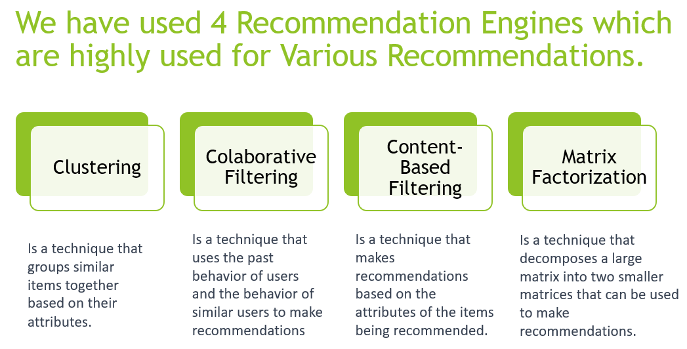
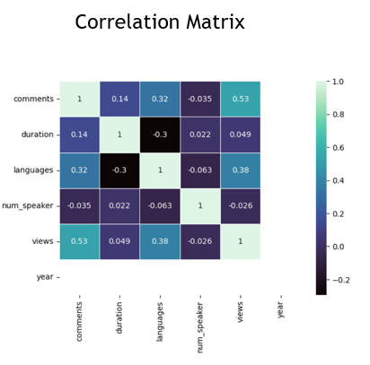
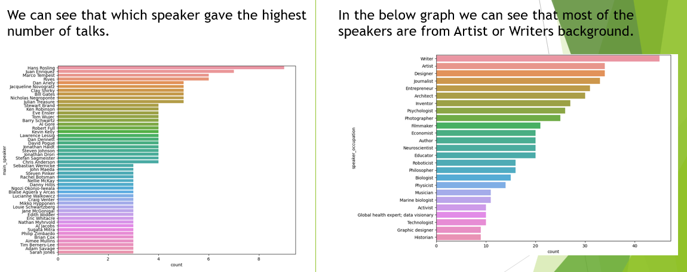
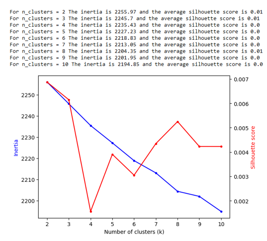
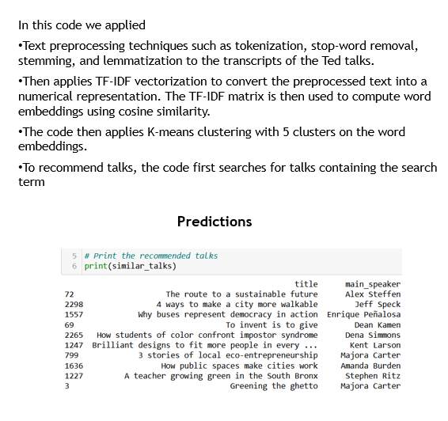

## 1. Title and Author

- Developing a Machine Learning-based Recommendation System for TED Talks
- Prepared for UMBC Data Science Master Degree Capstone by Dr Chaojie (Jay) Wang
- Author Name: SAI KEERTHI BOTLA
- Semester: Fourth Semester (Final Semester )
- LinkedIn: [http://www.linkedin.com/in/saikeerthibotla)
- GitHub: [https://github.com/SaiBotla)
- Presentation File:https://github.com/SaiBotla/UMBC-DATA606-Capstone/blob/9a59015fc42f5ef53876449d0dc97b537ce768a3/docs/Capstone.PPTX
- YouTube Link: https://youtu.be/saM_3B9TWOM?si=UAHFAe11a9Af9NOb
    
## 2. Background

TED Talks are popular video presentations covering a wide range of topics, including technology, entertainment, design, science, and business. With thousands of talks available on the TED website, finding the right one to watch can be challenging. A recommendation system can help users find talks that match their interests and preferences. This project proposes the development of a machine learning-based recommendation system for TED Talks.


#### Objective: 
The primary objective of this project is to develop a recommendation system that can recommend TED Talks to users based on their viewing history, preferences, and ratings. The system will use machine learning algorithms to learn from user interactions and make personalized recommendations.


## 3. Data 

The transcripts of all the audio and video recordings of Ted talks posted on Ted.com make up the dataset I'll be utilizing to build a recommendation engine for Ted Talks in this article.
Data Link: https://www.kaggle.com/datasets/rounakbanik/ted-talks?select=ted_main.csv

There are two CSV files.
ted_main.csv - Contains data on actual TED Talk metadata and TED Talk speakers.
transcripts.csv - Contains transcript and URL information for TED Talks

Ted Main has 17 columns and 2550 records:
1.	Comments: The number of first level comments made on the talk
2.	Description: A blurb of what the talk is about
3.	Duration: The duration of the talk in seconds
4.	Event: The TED/TEDx event where the talk took place
5.	film_date: The Unix timestamp of the filming
6.	languages: The number of languages in which the talk is available.
7.	main_speaker: The first named speaker of the talk
8.	name: The official name of the TED Talk. Includes the title and the speaker.
9.	num_speaker: The number of speakers in the talk
10.	published_date: The Unix timestamp for the publication of the talk on TED.com.
11.	ratings: A stringified dictionary of the various ratings given to the talk (inspiring, fascinating, jaw dropping, etc.)
12.	related_talks: A list of dictionaries of recommended talks to watch next.
13.	speaker_occupation: The occupation of the main speaker.
14.	tags: The themes associated with the talk.
15.	title: The title of the talk.
16.	url: The URL of the talk.
17.	views: The number of views on the talk.

##### Transcripts has Two columns, and both the columns are Text:
1.Transcript (Transcript of the Ted Talk) 
2.URL (link to the Ted Talk)
Data has 2464 Records.


## 4. Text Preprocessing
## Libraries Used

- **NLTK (Natural Language Toolkit):** Utilized for tokenization, stop words removal, stemming, and lemmatization.
- **scikit-learn's TfidfVectorizer:** Employed for TF-IDF (Term Frequency-Inverse Document Frequency) vectorization.
- **Pandas:** Used for data manipulation and storage.

##  Text Preprocessing Steps

### 1. Tokenization

Tokenization is the process of breaking down a text into individual words or tokens. In this script, the `word_tokenize` function from NLTK is used to tokenize each TED Talk transcript.

### 2. Stop Words Removal

Stop words, such as "the" and "is," are common words that often do not contribute significantly to the meaning of a text. The script employs NLTK's set of English stop words to filter out these less informative tokens.

### 3. Stemming

Stemming involves reducing words to their root or base form. The SnowballStemmer from NLTK is utilized to perform stemming on the remaining tokens, reducing inflected words to their root.

### 4. Lemmatization

Lemmatization is a more advanced form of word normalization that considers the context of words. The WordNetLemmatizer from NLTK is used to lemmatize the stemmed tokens, ensuring that words are reduced to their base or dictionary form.

### 5. Joining Tokens

The preprocessed tokens are then rejoined into a cohesive string, representing the cleaned and normalized version of the original TED Talk transcript.

## Applying Text Preprocessing

```python
# Apply text preprocessing
ted_data_df['processed_transcript'] = ted_data_df['transcript'].apply(preprocess_text)
```

The `preprocess_text` function is applied to each TED Talk transcript, generating a new column (`processed_transcript`) in the dataset containing the cleaned and normalized text.

## Applying TF-IDF Vectorization

```python
# Apply TF-IDF vectorization
tfidf_vectorizer = TfidfVectorizer()
tfidf_matrix = tfidf_vectorizer.fit_transform(ted_data_df['processed_transcript'])
```

TF-IDF vectorization is employed to convert the preprocessed text into numerical features. This technique considers the importance of words in the context of the entire dataset, assigning higher weights to terms that are more unique across multiple documents.

## Applying Word Embeddings

```python
# Apply word embeddings
word_embeddings = pd.DataFrame(tfidf_matrix.toarray(), columns=tfidf_vectorizer.get_feature_names_out())
```

The resulting TF-IDF matrix is transformed into word embeddings, which are stored in a Pandas DataFrame. Each column in the DataFrame corresponds to a unique feature, representing the importance of specific terms in the TED Talk transcripts.

This comprehensive text preprocessing pipeline prepares the data for further analysis, modeling, or exploration in the field of natural language processing. The resulting word embeddings capture the essential semantic information within the TED Talk transcripts.

## K-means Clustering

### Training
- The code applies K-means clustering with 5 clusters on word embeddings derived from TED Talk transcripts.
- The cluster labels are assigned to the TED Talk data.

### Evaluate the KMeans Clustering Model
- The code evaluates the KMeans clustering model by computing inertia and silhouette score for different numbers of clusters ranging from 2 to 10.
- Inertia and silhouette score for each number of clusters are printed.
- A plot is generated to visualize the evaluation metrics (inertia and silhouette score) against the number of clusters.

### Testing
- The code allows users to search for talks by title.
- It recommends talks from the same cluster as the searched talk based on cosine similarity between TF-IDF vectors.
- The top 10 most similar talks are printed as recommendations.

## Collaborative Filtering

### Preprocessing
- TED Talk data and transcripts are loaded and merged.
- Text preprocessing steps including tokenization, removing stop words, stemming, lemmatization, and POS tagging are performed on the transcripts.

### Training
- TF-IDF vectors are computed for the preprocessed transcripts.
- Cosine similarity between TF-IDF vectors is calculated to build a similarity matrix.

### Testing
- Given a talk title, the code recommends similar talks based on cosine similarity scores.
- The top 10 recommended talks are printed.

## Content-Based Filtering

### Preprocessing
- Text data preprocessing steps including tokenization, removing stop words, stemming, lemmatization, and POS tagging are performed on the transcripts.

### Training
- TF-IDF vectors are computed for the processed text data.
- Cosine similarity between TF-IDF vectors is calculated to build a similarity matrix.

### Testing
- Given a talk title, the code recommends similar talks based on cosine similarity scores.
- The top 10 recommended talks are printed.

## Matrix Factorization

### Preprocessing
- Missing values are dropped from the TED Talk data.
- Text preprocessing steps including tokenization, removing stop words, stemming, and lemmatization are performed on the transcripts.

### Training
- TF-IDF matrix is created for the processed text data.
- Cosine similarities between all talks are calculated.


### Testing
- Given a talk title, the code recommends similar talks based on cosine similarity scores.
- The top 5 recommended talks are printed.

## Evaluation
The evaluation of the collaborative filtering approach is discussed, providing insights into the effectiveness of the recommendation system.



## Future Goal
The future goals of the project include improving recommendation accuracy, enhancing the user interface, implementing advanced personalization techniques, incorporating a feedback loop, integrating with other platforms, optimizing performance, utilizing collaborative filtering, and exploring new data sources. These goals aim to enhance the effectiveness and usability of the recommendation system, providing users with a more personalized and engaging experience when exploring TED Talks.
