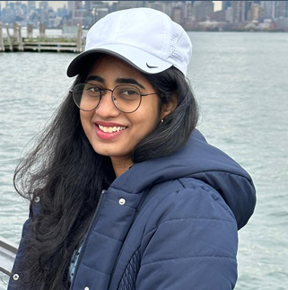

# SAI KEERTHI BOTLA

- Email: saikeerthibotla1@gmail.com 
- Phone: +1 (667) 380-3242 
- LinkedIn: http://www.linkedin.com/in/saikeerthibotla

## ABOUT ME:
Seeking a challenging position as a Data Analyst in the IT 
industry, where I can apply my strong analytical skills and 
data-driven insights to contribute to organizational 
growth and decision-making processes.

## AREA OF EXPERTISE:
- Java Full Stack 
- Project Management 
- Critical Thinking 
- Java 
- SQL 
- JavaScript 
- Angular 
- Azure DevOps 
- Java Spring-Boot 
- Docker

## WORK EXPERIENCE:
### Java full stack developer at HCL(Hindustan Computer Limited) 
<i>January 2022 — July 2022 </i> 
During my tenure as a Java Full Stack Developer at HCL (Hindustan Computer 
Limited), my role involved the development and maintenance of web applications 
using Java and associated technologies. Key contributions and responsibilities 
include:  
- Spearheaded the development and maintenance of web applications utilizing Java 
and related technologies. 
- Engaged in collaborative efforts with cross-functional teams to gather project 
requirements, fostering the delivery of high-quality software solutions. 
- Upheld code quality and maintainability standards through rigorous version 
control practices. 
- Played a pivotal role in the successful delivery of projects, ensuring client 
satisfaction through effective communication and solution-oriented approaches.

## EDUCATION:
- **Master of Science in Data Science (MSDS)**, University of Maryland 
Baltimore County
  - 2022 — 2024 
  - Pursuing Master's in Data Science with a current GPA of 3.71. 
- **Bachelor of Technology (B.Tech) degree in Electronics and 
  Communication Engineering**, Godavari Institute of Engineering and 
  Technology,India
  - 2017-2021

## CERTIFICATES:
- Certificate course on *Career Edge-Knockdown the Lockdown*, offered by 
TCS ion.
- Certificate course on *DIGITAL CIRCUITS* from an online course authorized 
by NPTEL. 
- Certificate course in *EMBEDDING SENSORS & MOTORS 
SPECIALIZATION* through Coursera. 
- Certificate of Appreciation from GIET for active participation in NSS activities. 
- Participant in the *VIKAS VARADHI* campaign organized by the Government 
of India.

## PROJECTS:

#### **Grain Classification System**
- Objective: Develop an automated system to classify different grains based on 
visual characteristics. 
- Description: Implemented a grain classification system using computer vision 
and machine learning techniques. Captured images of various grains, processed 
them through image recognition algorithms, and classified them into distinct 
categories. 
- Technologies Used: Python, OpenCV, Machine Learning (e.g., TensorFlow, 
scikit-learn).
- Role: Led the project from data preprocessing to model development. 
Collaborated with data engineers to handle large-scale data processing using big 
data technologies. Implemented and fine-tuned machine learning models for 
prediction. 
- Achievements/Results: Achieved high accuracy in grain classification, providing 
an efficient and reliable solution for automated quality control in agricultural 
processes. 

#### **Bank Marketing Forecasting for Term Deposit Subscription**
- Objective: Develop a predictive model using big data to forecast whether a client 
will subscribe to a term deposit in a bank marketing campaign. 
- Description: Leveraged big data analytics to analyze and predict customer 
behavior in subscribing to term deposits. Employed machine learning algorithms 
on extensive datasets, considering various features such as client demographics, 
transaction history, and marketing campaign interactions. 
- Technologies Used: Hadoop, Apache Spark, Python (Pandas, NumPy, Scikitlearn), Machine Learning. 
- Role: Led the project from data preprocessing to model development. 
Collaborated with data engineers to handle large-scale data processing using big 
data technologies. Implemented and fine-tuned machine learning models for 
prediction. 
- Achievements/Results: Successfully developed a predictive model with high 
accuracy, providing actionable insights for targeted marketing strategies. 
Improved the bank's campaign efficiency by identifying potential term deposit 
subscribers.
 

## HOBBIES:
I have a deep passion for movies, and during my leisure time, I enjoy crafting compelling stories through writing.
